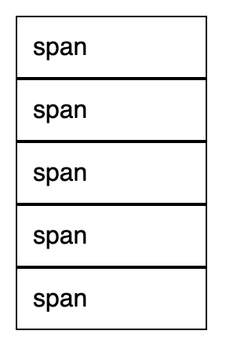
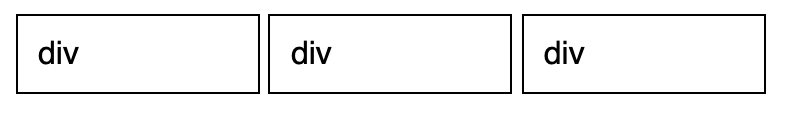

# What is the CSS display property and can you give a few examples of its use ?
`display` property defines how a box will be shown

[Make inline tag span to display as block element demo](https://codepen.io/kmsheng/pen/jJeXNW)

[Make div next to each others - inline-block demo](https://codepen.io/kmsheng/pen/PLyXor)
