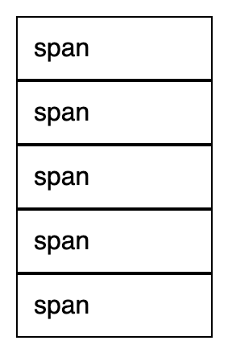

# What's the difference between inline and inline-block ?

[Make inline tag span to display as block element demo](https://codepen.io/kmsheng/pen/jJeXNW)

[Make div next to each others - inline-block demo](https://codepen.io/kmsheng/pen/PLyXor)
