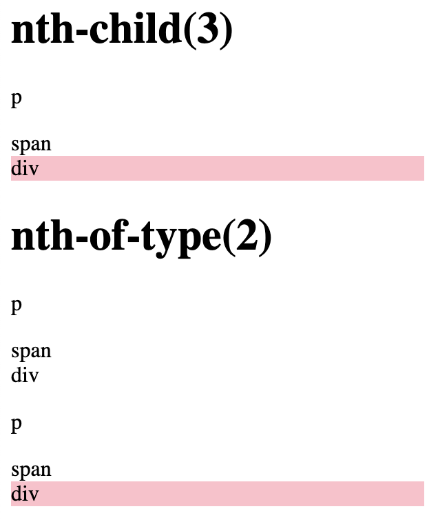

# What's the difference between the "nth-of-type()" and "nth-child()" selectors ?
`nth-child()` matches an element based on number and ignores tag type.

`nth-of-type()` works pretty much the same as `nth-child()` but only counts the tag with the same type.

[nth-child vs nth-of-type](https://codepen.io/kmsheng/pen/QoZzMG)

### References
 - https://bitsofco.de/nth-child-vs-nth-of-type/
