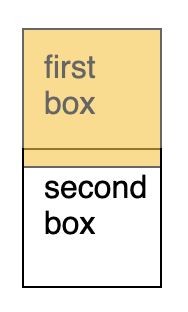

# What's the difference between a relative, fixed, absolute and statically positioned element ?

## position: static
Default position value, all elements are in order as they appear in the document.

## position: relative
With `relative` position, `left`, `right`, `top` and `bottom` can be set to itself.
The positioning will be relative to itself.

Elements that are around it will be placed based on its original position (Without top value).

[position relative demo](https://codepen.io/kmsheng/pen/EMdGzG)

## position: absolute
It allows you to place your element precisely where you want it, but it will be limited if its parent has `relative` position.

Note that the pink box has `bottom: 30px` and `right: 30px` set, positioning will be done relative to its parent with `relative` position.
If take the position `relative` off from parent, positioning will be done relative to the HTML element (the page itself). 

[position absolute demo](https://codepen.io/kmsheng/pen/LagMMv)

## position: fixed
Similar to `absolute`, but its position will be fixed to window and will remain in same position even when the user scrolls the page.
