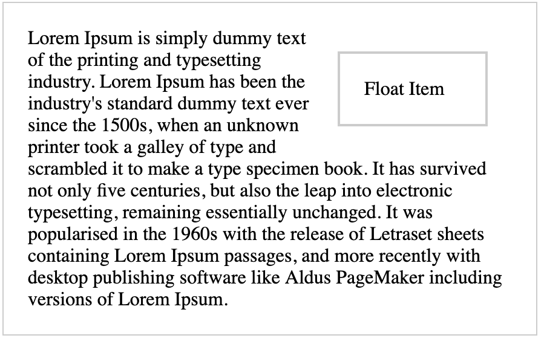

# Describe Floats and how they work.
Float is a css property that allows an element to be placed on left or right of its container.

Common use cases are text wrapping and multi-columns layout.

[Text wrapping float left demo](https://codepen.io/kmsheng/pen/qvKxxP)

[Text wrapping float right demo](https://codepen.io/kmsheng/pen/Lardeq)

## Techniques for clearing floats

[Parent element height collapsed demo](https://codepen.io/kmsheng/pen/vPrRaB)

As you can see, the parent element's gray border cannot hold the floated children.

To fix the parent element collapsed problem, there are several solutions.

 - [Add `overflow: auto` to parent element to create block formatting context.](https://codepen.io/kmsheng/pen/BbVxWw)
 - [Add `clearfix` class to parent element](https://codepen.io/kmsheng/pen/rRKvwb)
 - [Use `inline-block` instead of float](https://codepen.io/kmsheng/pen/EMRLwq)
 - [Use `flexbox` instead of float](https://codepen.io/kmsheng/pen/QoxraB)
 - [Use `grid` instead of float](https://codepen.io/kmsheng/pen/xBzjjG)

### References
 - https://developer.mozilla.org/en-US/docs/Web/CSS/float
 - https://perishablepress.com/lessons-learned-concerning-the-clearfix-css-hack/
