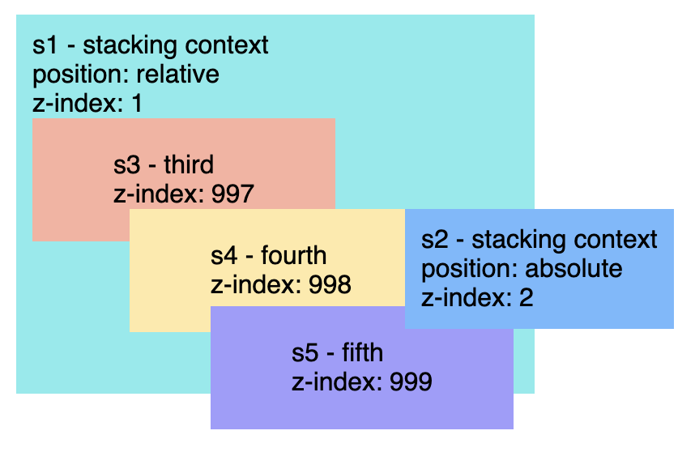

# Describe z-index and how stacking context is formed.
z-index sets the stack order of a positioned element. The element with greater stack order is in front of an element with a lower stack order.

## How to create a stacking context ?
 - Root element of the document `html`
 - Element with a position value `absolute` or `relative` and a z-index value other than `auto`
 - Other scenarios see [here](https://developer.mozilla.org/en-US/docs/Web/CSS/CSS_Positioning/Understanding_z_index/The_stacking_context#The_stacking_context)
 

[Stacking context demo](https://codepen.io/kmsheng/pen/PLadOK)

[Stacking context demo 2](https://codepen.io/kmsheng/pen/drKKem)

Note that div `s5` has a z-index of 999 but still unable to be on top of div `s2` is because s5's parent s1 has a z-index of 1.

### References
 - https://developer.mozilla.org/en-US/docs/Web/CSS/z-index
 - https://developer.mozilla.org/en-US/docs/Web/CSS/CSS_Positioning/Understanding_z_index/Adding_z-index
 - https://developer.mozilla.org/en-US/docs/Web/CSS/CSS_Positioning/Understanding_z_index/The_stacking_context
 - https://juejin.im/post/5b53e4f751882519f6476a44
