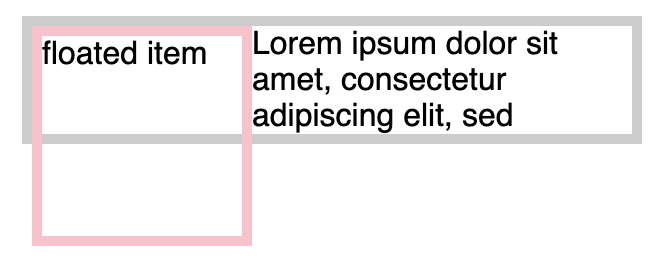
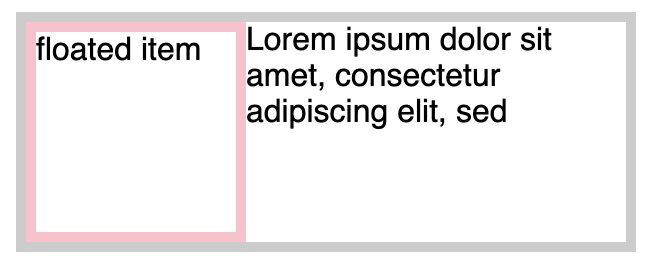
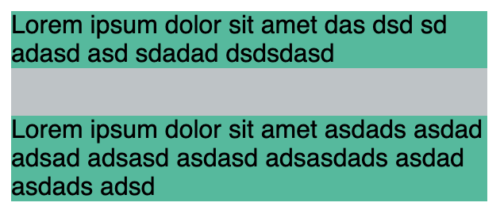
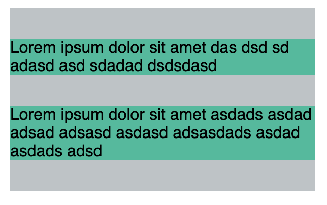

# Describe BFC (Block Formatting Context) and how it works.
BFC is the region which the layout of block boxes occurs and in which floats interact with other elements.

## BFC solves two major problems
 - Collapsing of parent element
 - Margin collapsing
 
## BFC is created by at least one of the following

 - the root element or something that contains it
 - floats (elements where float is not none)
 - absolutely positioned elements (elements where position is absolute or fixed)
 - inline-blocks (elements with display: inline-block)
 - table cells (elements with display: table-cell, which is the default for HTML table cells)
 - table captions (elements with display: table-caption, which is the default for HTML table captions)
 - anonymous table cells implicitly created by the elements with display: table, table-row, table-row-group, table-header-group, table-footer-group (which is the default for HTML tables, table rows, table bodies, table headers and table footers, respectively), or inline-table 
 - block elements where overflow has a value other than visible
 - display: flow-root
 - elements with contain: layout, content, or strict
 - flex items (direct children of the element with display: flex or inline-flex)
 - grid items (direct children of the element with display: grid or inline-grid)
 - multicol containers (elements where column-count or column-width is not auto, including elements with column-count: 1)
 - column-span: all should always create a new formatting context, even when the column-span: all element isn't contained by a multicol container (Spec change, Chrome bug).
 
 
 
 [Parent element collapsing](https://codepen.io/kmsheng/pen/xBJdad)
 
 
 
 [Fix parent element collapsing](https://codepen.io/kmsheng/pen/pYZPYJ)
 
 
 
 [Margin collapsing](https://codepen.io/kmsheng/pen/JzBJGp)
 
 
 
 [Fix margin collapsing](https://codepen.io/kmsheng/pen/RdBgyz)
 
 ### References
  - https://developer.mozilla.org/en-US/docs/Web/Guide/CSS/Block_formatting_context
  - https://www.smashingmagazine.com/2017/12/understanding-css-layout-block-formatting-context/
