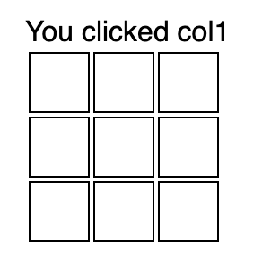

# Explain event delegation
Sometimes we need to bind mass number of event on whole bunch of elements.

Instead of binding each of them one by one, we bind to their common parent and determine which child is processed in the event callback.

React also does the [similar thing](https://levelup.gitconnected.com/how-exactly-does-react-handles-events-71e8b5e359f2) with virtual DOM.

[Event delegation demo](https://codepen.io/kmsheng/pen/gEQObv)

### References
 - https://levelup.gitconnected.com/how-exactly-does-react-handles-events-71e8b5e359f2
 - https://medium.com/@bretdoucette/part-4-what-is-event-delegation-in-javascript-f5c8c0de2983
