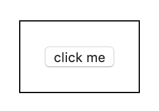

# Describe event bubbling.
When an event happens, it first runs the handler on the element itself, then on its parent and all the way to its ancestor.

[Event bubbling demo](https://codepen.io/kmsheng/pen/Yggyxq)

It will trigger button's click event and then its parent.

### References
 - https://javascript.info/bubbling-and-capturing
