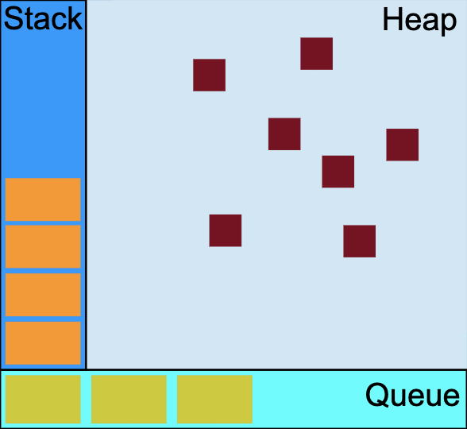

# What is event loop ?
`event loop` is a concurrency model that makes JavaScript asynchronous.



```js
function second(x, y) {
  return x + y;
}

function first(x) {
  let y = 1;
  return second(x, y);
}

first(1);
```

- When calling `first` function, a frame is added to stack.
- If there are variables, store them to heap.
- Add another frame to stack for `second` function call
- Sees return keyword, removes frame of `second` function
- Sees return keyword, removes frame of `first` function
- After call stack is empty, process message queue

## What is the difference between call stack and task queue ?
`synchronous` functions are associated with call stack and `asynchronous` functions are associated with task queue.

Task queue is process after call stack is empty.

### References
 - https://developer.mozilla.org/en-US/docs/Web/JavaScript/EventLoop
 - https://medium.com/front-end-weekly/javascript-event-loop-explained-4cd26af121d4
