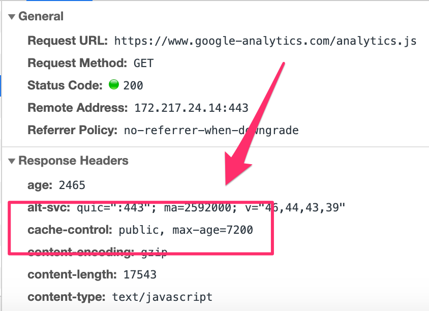

# Explain the following request and response headers

## Diff. between Expires, Date, Age and If-Modified-...
 - `Expires` response header indicates the expiration date.
 - `Date` response header is the date for which the message has been originated.
 - `Age` response header indicates the duration of a request in a proxy. Usually it's the proxy's current date minus the date from `Date` header.
 - `If-Modified-Since` request header makes the request conditional. If the data's modification date is laster than the date of `If-Modified-Since`, then respond the resource with status `200`, otherwise `304` without any body.

## Do Not Track
 - a.k.a `DNT` header that represents a user's tracking preference.

## Cache-Control
It's a header with many directives which is used in both requests and responses.

For example

 - `public` means the resource is public which can be cached by any cache and can be used by others.
 - `max-age` indicates how long this resource is considered fresh.

## Transfer-Encoding
Specify the encoding that is used to safely transfer the data to user.

## ETag
Another value other than time to validate the cache's freshness. The spec does not tell how to generate the value.
Usually it's a hash like value.

## X-Frame-Options
A response header that tells whether or not a browser should render a page in `<frame>`, `<iframe>`, `<embed>` or `<object>`. 

 - Specify `deny` value if you don't want anyone to embed your website.
 - `sameorigin` means it can be embded in the same domain.
 - `allow-from uri` specifies origin which can embed your website.

### References
 - https://developer.mozilla.org/en-US/docs/Web/HTTP/Headers
 - https://gist.github.com/CMCDragonkai/6bfade6431e9ffb7fe88
 - https://blog.othree.net/log/2012/12/22/cache-control-and-etag/
